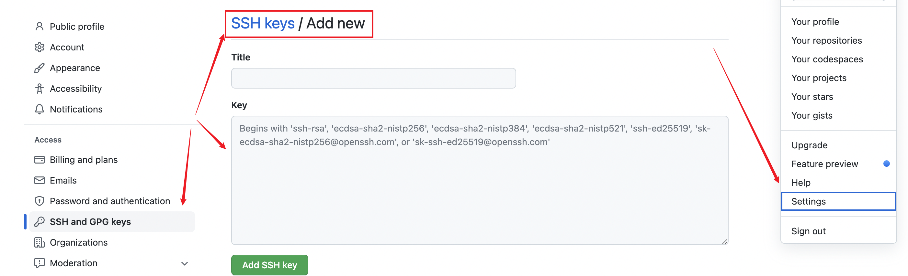
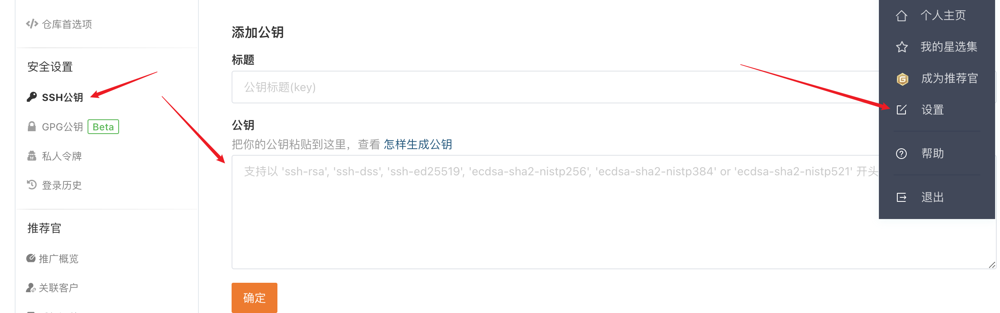

在日常开发中，经常会遇到一台电脑需要配置多个git账户的场景，例如工作项目在gitlab、日常练习项目在github等等。这就需要我们配置一个共存的开发环境。本文主要介绍如何在mac上如何同时管理多个git账号 （gitlab、gitee、github）及遇到问题的记录。

## 版本

macOS： 12.3.1 
Git： 2.32.0

## 查看是否已安装Git

首先确认已安装Git，能够通过过命令能够查看当前安装的版本。

```bash

 git –version
```

Mac OSX 中默认都已经安装了Git。可是，Git的版本未必是最新的。可以使用以下命令进行更新：

```bash
git clone https://github.com/git/git
```

## 1. 清除git遗留的历史配置

如果之前设置过全局 user.name 和 user.email，这里必须要清空，

**1.1 查看已配置git信息**

``` bash

git config --list
```

**1.2 清空用户名和邮箱信息（未配置跳过此步骤）**

```bash
git config --global --unset user.name
git config --global --unset user.email
```

## 2. 生成新的 SSH key

打开终端，切换到对应目录下：

```bash
cd ~/.ssh
```

[.ssh文件可能会遇到的问题记录](#mac查找.ss文件注意事项)

接下来 ⬇️ ⬇️ ⬇️ 需要在~/.ssh/路径下执行以下操作命令。

**2.1 GitHub 的钥匙**

设定别名 id_rsa.github，对应于不同的git账号

指定文件路径，方便后面操做：~/.ssh/id_rsa.github

```bash
ssh-keygen -t rsa -f ~/.ssh/id_rsa.github -C "97*****5@qq.com"
```

回车3次(密码可以为空)，在当前路径下能看到两个文件 id_rsa.github 和 id_rsa.github.pub ，对应于私钥和公钥。

**2.2 Gitee 的钥匙**

```bash 
ssh-keygen -t rsa -f ~/.ssh/id_rsa.gitee -C "*******@qq.com"
```

**2.3 GitLab 的钥匙**

```bash
ssh-keygen -t rsa -f ~/.ssh/id_rsa.gitlab -C "*******@company.com"
```

**2.4 完成后会在.ssh目录下生成一下文件**

- id_rsa.github		
- id_rsa.github.pub	

- id_rsa.gitlab
- id_rsa.gitlab.pub

- id_rsa.gitee
- id_rsa.gitee.pub	


## 3. 在 ~/.ssh 目录下新建一个config文件

**3.1 终端新建config文件并打开**

```bash
# 新建
touch ~/.ssh/config

# ～/.ssh目录下打开config
open config
```

**3.2 config里面填写内容（完整配置）**

```bash
#github

 Host github.com

 HostName github.com

 PreferredAuthentications publickey

 IdentityFile ~/.ssh/id_rsa.github


#gitee

 Host gitee.com

 HostName gitee.com

PreferredAuthentications publickey

 IdentityFile ~/.ssh/id_rsa.gitee

# gitlab 

# 此处Host和Host Name需要设置为自己项目的地址
# 假设有仓库git@gitlab.mygitlab.com:iEngne/test.git，取冒号前的gitlab.mygitlab.com

Host gitlab.mygitlab.com

HostName gitlab.mygitlab.com

PreferredAuthentications publickey

IdentityFile ~/.ssh/id_rsa.gitlab
```

以下内容是上述配置文件中使用到的配置字段信息进行简单解释：

- Host
它涵盖了下面一个段的配置，我们可以通过他来替代将要连接的服务器地址。
这里可以使用任意字段或通配符。
当ssh的时候如果服务器地址能匹配上这里Host指定的值，则Host下面指定的HostName将被作为最终的服务器地址使用，并且将使用该Host字段下面配置的所有自定义配置来覆盖默认的/etc/ssh/ssh_config配置信息。

- Port
自定义的端口。默认为22，可不配置

- User
自定义的用户名，默认为git，可不配置

- HostName
真正连接的服务器地址

- PreferredAuthentications
指定优先使用哪种方式验证，支持密码和秘钥验证方式

- IdentityFile
指定本次连接使用的密钥文件

## 4. 在远程仓库gitlab上添加title和key

### GitHub
 
在～/.ssh目录下打开id_rsa.github.pub并复制内容

```bash
# 打开文件
cat id_rsa.github.pub

#复制ssh-rsa 开头的内容
```

直达地址：https://github.com/settings/keys



### Gitee
 
在～/.ssh目录下打开id_rsa.gitee.pub并复制内容

```bash
# 打开文件
cat id_rsa.gitee.pub

#复制ssh-rsa 开头的内容
```

直达地址：https://gitee.com/profile/sshkeys



### GitLab
 
在～/.ssh目录下打开id_rsa.gitlab.pub并复制内容

```bash
# 打开文件
cat id_rsa.gitlab.pub

#复制ssh-rsa 开头的内容
```


## 用ssh命令分别测试

```bash

ssh -T git@gitee.com
ssh -T git@github.com
ssh -T git@gitlab.com
```

这里以gitee为例，成功的话会返回下图内容


## mac查找.ss文件注意事项
 **1. .ssh已存在，但是cd ～/.ssh提示未找到**

 我遇到的问题：
 1. cd ~/.ssh
 ``` 
 MacBook-Pro ~ % cd ~/.ssh
 cd: no such file or directory: /Users/hz/.ssh
 ```

 2. ssh-keygen

```bash

ssh-keygen -t rsa
Generating public/private rsa key pair.
Enter file in which to save the key (/root/.ssh/id_rsa): 
Enter passphrase (empty for no passphrase): 
Enter same passphrase again: 
Saving key "/root/.ssh/id_rsa" failed: Not a directory
```

3. .ssh提示不是一个文件，查看文件ls -la

观察.ssh 和其他文件夹的区别,可以发现已经存在的.ssh并不是一个文件夹，我们可以删除已有的 .ssh，再ssh-keygen就会有.ssh文件夹了，

4. 删除.ssh文件，新建.ssh文件夹

```bash
# 删除.ssh 文件
rm -rf .ssh

# 新建.ssh文件夹
mkdir ～/ .ssh
```

##  配置git config

一般来说，安装好 git 后，我们都会配置一个全局的 config 信息。但是，我们需要在一台电脑上配置多个用户信息的需求，此时就不能够用一个全局配置搞定一切了。因为不仅仓库地址不一样，仓库的用户名和邮箱都不一样。

 git 的配置分为三级别，System —> Global —>Local。System 即系统级别，Global 为配置的全局，Local 为仓库级别，优先级是 Local > Global > System。

因为我们并没有给仓库配置用户名，又在一开始清除了全局的用户名，因此此时你提交的话，就会使用 System 级别的用户名作为你提交的用户名，也就是你的系统主机名了。

### system系统级

系统级配置文件含有系统里每位用户及他们所拥有的仓库的配置值。其位置为git的安装目录下的/etc/gitconfig，即如果git的安装目录为D:\Git，则配置文件地址为D:\Git\etc\gitconfig。

**优先度最低，其配置值可被全局级配置和本地级配置的值覆盖**，一般我们很少会使用系统级的配置。

### global全局级

全局级配置文件包含当前系统用户的拥有的仓库配置值，每个系统用户的全局级配置相互隔离。全局级别的配置默认保存在当前系统用户的主目录下的 .gitconfig 文件内。Windows通常保存在C:\Users\xxxx\.gitconfig，Linux为/home/xxx/.gitconfig。

**优先度比系统级高，可覆盖系统级的配置值**，全局级的配置平时使用得比较多，比如设置账号和邮箱：

```bash
git config --global user.name “xxxxxx”
git config --global user.email “xxxxx@panyanbin.com”
```

查看配置信息

```bash
git config --global --list
```

### local本地级

本地级别的配置保存在当前仓库下面的 .git\config 文件内，通常 .git 文件夹是隐藏的，Window要在文件管理器的文件夹选项中打开显示隐藏文件夹才可以看到。这里的配置仅对当前仓库有效，不影响其他的仓库。

**优先级别最高，如果全局级别或系统级别的配置里出现了同一配置项，则以本地级别配置内容为准**

```bash
git config --local user.name “xxxxxx”
git config --local user.email “xxxxxx@foxmail.com"
```

查看配置信息

```bash
git config --local --list
```
