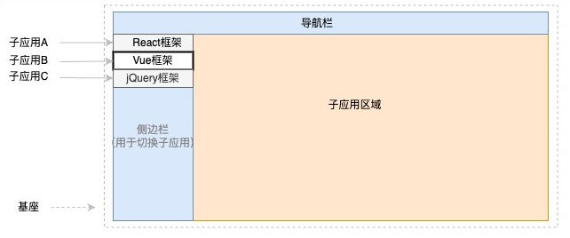

## 什么是微前端

微前端提供了一种技术：可以将多个独立的Web应用聚合到一起，提供统一的访问入口。一个微前端应用给用户的感观就是一个完整的应用，但是在技术角度上是由一个个独立的应用组合通过某种方式组合而成的，各个前端应用还可以独立运行、独立开发、独立部署。**微前端不是单纯的前端框架或者工具，而是一套架构体系**。

当整个微前端框架运行之后，给用户的体验就是类似下图所示：



简单描述下就是基座应用中有一些菜单项，点击每个菜单项可以展示对应的子应用，这些应用的切换是纯前端无感知的。

## why not iframe

iframe 优点 ：

- iframe 自带的样式、环境隔离机制使得它具备天然的 沙盒机制。
- 嵌入 子应用比较 简单 。

```html
<iframe src="https://test.qq.com/a/index.html"></iframe>
```

iframe 缺点 ：

- iframe功能之间的跳转是无效的，刷新页面 无法保存 状态。
- URL的记录完全无效，刷新会返回首页。
- 主应用 劫持 快捷键操作，事件冒泡 不穿透 到主文档树上。
- 模态弹窗的背景是无法覆盖到整个应用。
- iframe应用加载失败，内容发生错误主应用无法感知， 通信麻烦 。

综上，iframe也可以实现微前端，但是iframe这些无法解决的问题又会给产品带来非常严重的体验问题。

## 目前业界内已有框架

[Mooa](https://link.juejin.cn?target=https%3A%2F%2Fwww.npmjs.com%2Fpackage%2Fmooa)：基于Angular的微前端服务框架

[Single-Spa](https://link.juejin.cn?target=https%3A%2F%2Fwww.npmjs.com%2Fpackage%2Fsingle-spa)：最早的微前端框架，兼容多种前端技术栈。

[Qiankun](https://link.juejin.cn?target=https%3A%2F%2Fwww.npmjs.com%2Fpackage%2Fqiankun)：基于Single-Spa，阿里系开源微前端框架。

[Icestark](https://link.juejin.cn?target=https%3A%2F%2Fwww.npmjs.com%2Fpackage%2Ficestark)：阿里飞冰微前端框架，兼容多种前端技术栈。

[Ara Framework](https://link.juejin.cn?target=https%3A%2F%2Fwww.npmjs.com%2Fpackage%2Fhttps%3A%2F%2Fara-framework.github.io%2Fwebsite%2Fdocs%2Fquick-start)：由服务端渲染延伸出的微前端框架。

## 为什么使用`Qiankun`

阿里开源的一套框架，基于single-spa的上层封装，社区活跃度较高，在国内的生态较好，中文文档齐全，有大量的先行者铺路，比较适合用于生产环境。

- 📦 **基于 [single-spa](https://github.com/CanopyTax/single-spa)** 封装，提供了更加开箱即用的 API。
- 📱 **技术栈无关**，任意技术栈的应用均可 使用/接入，不论是 React/Vue/Angular/JQuery 还是其他等框架。
- 💪 **HTML Entry 接入方式**，让你接入子应用像使用 iframe 一样简单。
- 🛡 **样式隔离**，确保子应用之间样式互相不干扰。
- 🧳 **JS 沙箱**，确保子应用之间 全局变量/事件 不冲突。
- ⚡️ **资源预加载**，在浏览器空闲时间预加载未打开的子应用资源，加速子应用打开速度。
- 🔌 **umi 插件**，提供了 [@umijs/plugin-qiankun](https://github.com/umijs/plugins/tree/master/packages/plugin-qiankun) 供 umi 应用一键切换成微前端架构系统。

## `Qiankun`做了什么

首先，qiankun 并不是单一个框架，它在 single-spa 基础上添加更多的功能，并解决了前者的一些问题。以下是 qiankun 提供的特性：

- 实现了子应用的加载，在原有 single-spa 的 JS Entry 基础上再提供了 HTML Entry
- 样式和 JS 隔离
- 更多的生命周期：beforeMount, afterMount, beforeUnmount, afterUnmount
- 子应用预加载
- 全局状态管理
- 全局错误处理

`single-spa`和`qiankun`最大的不同，我认为就是`qiankun`实现了`html entry`，而`single-spa`只能是`js entry`

### JS Entry 有什么问题

`single-spa` 就做了两件事情：

- 加载微应用（加载方法还得用户自己来实现）
- 管理微应用的状态（初始化、挂载、卸载）

而 `JS Entry` 的理念就在加载微应用的时候用到了，在使用 `single-spa` 加载微应用时，我们加载的不是微应用本身，而是微应用导出的 `JS` 文件，而在入口文件中会导出一个对象，这个对象上有 `bootstrap`、`mount`、`unmount` 这三个接入 `single-spa` 框架必须提供的生命周期方法，其中 `mount` 方法规定了微应用应该怎么挂载到主应用提供的容器节点上，当然你要接入一个微应用，就需要对微应用进行一系列的改造，然而 `JS Entry` 的问题就出在这儿，改造时对微应用的侵入行太强，而且和主应用的耦合性太强。

`single-spa` 采用 `JS Entry` 的方式接入微应用。微应用改造一般分为三步：

- 微应用路由改造，添加一个特定的前缀
- 微应用入口改造，挂载点变更和生命周期函数导出
- 打包工具配置更改

侵入型强其实说的就是第三点，更改打包工具的配置，使用 `single-spa` 接入微应用需要将微应用整个打包成一个 `JS` 文件，发布到静态资源服务器，然后在主应用中配置该 `JS` 文件的地址告诉 `single-spa` 去这个地址加载微应用。

将整个微应用打包成一个 `JS` 文件，，它只暴露了一个方法来加载资源，这意味着如果你有多个chunk，需要自己根据加载顺序依次加载。简而言之，它必须**串行加载，浪费时间，白屏时间长**，常见的打包优化基本上都没了，比如：按需加载、首屏资源加载优化、css 独立打包等优化措施。

### HTML Entry

qiankun解决了这个问题，它希望我们像使用iframe一样加载一个子应用，只需要知道其html的url就能加载到主应用中。

`HTML Entry` 是由 `import-html-entry` 库实现的，通过 `http` 请求加载指定地址的首屏内容即` html` 页面，然后解析这个 `html` 模版得到` template`, `scripts` , `entry`, `styles`

[import-html-entry](https://link.zhihu.com/?target=https%3A//github.com/kuitos/import-html-entry)用法如下：

```javascript
import importHTML from 'import-html-entry';

importHTML('./subApp/index.html')
  .then(res => {
    console.log(res.template); // 拿到 HTML 模板

    res.execScripts().then(exports => { // 执行 JS 脚本
      const mobx = exports; // 获取 JS 的输出内容
      // 下面就是拿到 JS 入口的内容，并用来做一些事
      const { observable } = mobx;
      observable({
        name: 'kuitos'
      })    
    })
});
```

以下为如何加载子应用的伪代码

```javascript
// 解析 HTML，获取 html，js，css 文本
const {htmlText, jsText, cssText} = importHTMLEntry('https://xxxx.com')

// 创建容器
const $= document.querySelector(container)
$container.innerHTML = htmlText

// 创建 style 和 js 标签
const $style = createElement('style', cssText)
const $script = createElement('script', jsText)

$container.appendChild([$style, $script])

```

当前这个应用完美地插入了 style 和 script 标签，那下一个应用 mount 时就会被前面的 style 和 script 污染，`qiankun`为了解决这两个问题，采取了样式隔离、JS隔离。

### 微前端的应用隔离

应用隔离问题主要分为主应用和子应用，子应用和子应用之间的JavaScript执行环境隔离，CSS样式隔离，我们先来说下CSS的隔离。

**1. CSS隔离**：当主应用和子应用同屏渲染时，就可能会有一些样式会相互污染，如果要彻底隔离CSS污染，可以采用CSS Module 或者命名空间的方式，给每个子应用模块以特定前缀，即可保证不会互相干扰，可以采用webpack的postcss插件，在打包时添加特定的前缀。

而对于子应用与子应用之间的CSS隔离就非常简单，在每次应用加载时，将该应用所有的link和style 内容进行标记。在应用卸载后，同步卸载页面上对应的link和style即可。

**2. JavaScript隔离**：每当子应用的JavaScript被加载并运行时，它的核心实际上是对全局对象Window的修改以及一些全局事件的改变，例如jQuery这个js运行后，会在Window上挂载一个`window.$`对象，对于其他库React，Vue也不例外。为此，需要在加载和卸载每个子应用的同时，尽可能消除这种冲突和影响，最普遍的做法是采用沙箱机制（SandBox）。

沙箱机制的核心是让局部的JavaScript运行时，对外部对象的访问和修改处在可控的范围内，即无论内部怎么运行，都不会影响外部的对象。通常在Node.js端可以采用vm模块，而对于浏览器，则需要结合with关键字和window.Proxy对象来实现浏览器端的沙箱。

`qiankun`有三种Js隔离机制，并且在源代码中也是以 SnapshotSandbox、LegacySandbox、ProxySandbox三个类名来指代三种不同的隔离机制。统一以快照沙箱、支持单应用的代理沙箱、支持多应用的代理沙箱，来代表这三种不同的Js隔离机制。

2.1 快照沙箱 - snapshotSandbox

快照沙箱就是在应用沙箱挂载和卸载的时候记录快照，在应用切换的时候依据快照恢复环境。

- 优点
  - 兼容几乎所有浏览器
- 缺点
  - 无法同时有多个运行时快照沙箱，否则在 window 上修改的记录会混乱，一个页面只能运行一个单实例微应用

2.2 代理沙箱 - proxySandbox

当有多个实例的时候，比如有`A`、`B`两个应用，`A` 应用就活在 `A` 应用的沙箱里面，`B` 应用就活在 `B` 应用的沙箱里面，`A` 和 `B` 无法互相干扰，这样的沙箱就是**代理沙箱**，这个沙箱的实现思路其实也是通过 `ES6` 的 [proxy](https://developer.mozilla.org/zh-cn/docs/web/javascript/reference/global_objects/proxy)，通过**代理特性**实现的。

- 优点
  - 可同时运行多个沙箱
  - 不会污染 window 环境

- 缺点
  - 不兼容 ie
  - 在全局作用域上通过 var 或 function 声明的变量和函数无法被代理沙箱劫持，因为代理对象 Proxy 只能识别在该对象上存在的属性，通过 var 或 function 声明声明的变量是开辟了新的地址，自然无法被 Proxy 劫持。

## 在umi/max中使用微前端

`@umi/max` 内置了 **Qiankun 微前端**[插件](https://github.com/umijs/umi/blob/master/packages/plugins/src/qiankun.ts)，它可以一键启用 Qiankun 微前端开发模式，可以轻松地在 Umi 项目中集成 Qiankun 子应用，构建出一个生产可用的微前端架构系统。

### 技术组合选择

主应用： UmiJS

子应用同时支持： UmiJS , Vue 

以下的配置，讲述主应用在开发时的一些基本配置，以及使用**不同的框架**搭建子应用时的**不同配置**，主要是应用接入 / 应用通信 / 应用隔离，几个方面的配置。

### 配置主应用：注册子应用

修改父应用的 Umi 配置文件，添加如下内容：

```typescript
// .umirc.ts
export default {
  qiankun: {
    master: {
      apps: [
        {
          name: 'app1',
          entry: '//localhost:7001',
        },
        {
          name: 'app2',
          entry: '//localhost:7002',
        },
      ],
    },
  },
};
```


### 配置子应用

#### 子应用项目基于 Umi ,且安装qiankun

```typescript
// .umirc.ts
export default {
  qiankun: {
    slave: {},
  },
};
```

#### 其他框架的子应用，无需安装qiankun

子应用需要在自己的入口 js (通常就是你配置的 webpack 的 entry js) 导出 `bootstrap`、`mount`、`unmount` 三个生命周期钩子，以供主应用在适当的时机调用。

```javascript
/**
 * bootstrap 只会在子应用初始化的时候调用一次，下次子应用重新进入时会直接调用 mount 钩子，不会再重复触发 bootstrap。
 * 通常我们可以在这里做一些全局变量的初始化，比如不会在 unmount 阶段被销毁的应用级别的缓存等。
 */
export async function bootstrap() {
  console.log('react app bootstraped');
}

/**
 * 应用每次进入都会调用 mount 方法，通常我们在这里触发应用的渲染方法
 */
export async function mount(props) {
  ReactDOM.render(<App />, props.container ? props.container.querySelector('#root') : document.getElementById('root'));
}

/**
 * 应用每次 切出/卸载 会调用的方法，通常在这里我们会卸载子应用的应用实例
 */
export async function unmount(props) {
  ReactDOM.unmountComponentAtNode(
    props.container ? props.container.querySelector('#root') : document.getElementById('root'),
  );
}

/**
 * 可选生命周期钩子，仅使用 loadMicroApp 方式加载子应用时生效
 */
export async function update(props) {
  console.log('update props', props);
}
```

除了代码中暴露出相应的生命周期钩子之外，为了让主应用能正确识别子应用暴露出来的一些信息，子应用的打包工具需要增加如下配置：

webpack:

```javascript
const packageName = require('./package.json').name;

module.exports = {
  output: {
    library: `${packageName}-[name]`,
    libraryTarget: 'umd',
    jsonpFunction: `webpackJsonp_${packageName}`,
  },
};
```

### 引入子应用

基于 [Umi 路由](https://umijs.org/docs/guides/routes)绑定子应用。

```typescript
// .umirc.ts
export default {
  routes: [
    {
      path: '/',
      component: '@/layouts/index.tsx',
      routes: [
        {
          path: '/app1',
          component: '@/pages/app1/index.tsx',
          routes: [
            // 配置子应用 app1 关联的路由
            {
              path: '/app1/project',
              microApp: 'app1',
            },
          ],
        },
        // 配置 app2 关联的路由
        {
          path: '/app2',
          microApp: 'app2',
        },
      ],
    },
  ],
};
```

## 子应用生命周期

Qiankun 在 single-spa 的基础上实现了一些额外的生命钩子。按照子应用的生命周期顺序，Qiankun 支持的完整的生命钩子列表如下：

- `beforeLoad`，子应用**开始获取前**调用。最初，子应用为 `NOT_LOADED` 状态。
- [`load`](https://single-spa.js.org/docs/building-applications/#load)，子应用**获取完成时**调用。开始获取子应用时，子应用变成 `LOADING_SOURCE_CODE` 状态。若获取成功，子应用变成 `NOT_BOOTSTRAPPED` 状态；若获取失败，子应用变成 `LOAD_ERROR` 状态。
- [`bootstrap`](https://single-spa.js.org/docs/building-applications/#bootstrap)，子应用**初始化完成时**调用。开始初始化子应用时，子应用变成 `BOOTSTRAPPING` 状态。初始化完成时，子应用变成 `NOT_MOUNTED` 状态。
- `beforeMount`，子应用每次**开始挂载前**调用。
- [`mount`](https://single-spa.js.org/docs/building-applications/#mount)，子应用每次**开始挂载时**调用。子应用变成 `MOUNTING` 状态。
- `afterMount`，子应用每次**挂载完成时**调用。子应用变成 `MOUNTED` 状态。
- `beforeUnmount`，子应用每次**开始卸载前**调用。
- [`unmount`](https://single-spa.js.org/docs/building-applications/#unmount)，子应用每次**开始卸载时**调用。子应用变成 `UNMOUNTING` 状态。
- `afterUnmount`，子应用每次**卸载完成时**调用。子应用变成 `NOT_MOUNTED` 状态。
- [`unload`](https://single-spa.js.org/docs/building-applications/#unload)，子应用**卸下完成时**调用。子应用变成 `NOT_LOADED` 状态。

### 父应用配置生命周期钩子

在父应用的 `src/app.ts` 中导出 `qiankun` 对象进行全局配置，所有的子应用都将实现这些生命周期钩子：

```typescript
// src/app.ts
export const qiankun = {
  lifeCycles: {
    // 所有子应用在挂载完成时，打印 props 信息
    async afterMount(props) {
      console.log(props);
    },
  },
};
```

### 子应用配置生命周期钩子

#### 子应用项目基于 Umi ,且安装qiankun

在子应用的 `src/app.ts` 中导出 `qiankun` 对象，实现生命周期钩子：

```typescript
// src/app.ts
export const qiankun = {
  // 子应用在挂载完成时，打印 props 信息
  async afterMount(props) {
    console.log(props);
  },
};
```

#### 其他框架的子应用，无需安装qiankun

需要在自己的入口 js , 导出 `afterMount`生命周期钩子

```
export async function afterMount() {
  console.log('vue app afterMount');
}
```

## 父子应用通信

父子应用间的通信有两种实现的方法：

- 基于 `useModel()` 的通信。这是 Umi **推荐**的解决方案。（适用于基于Umi的子应用，且引入了 [数据流](https://github.com/umijs/umi/blob/master/packages/plugins/src/model.ts) 插件）
- 基于配置的通信。（适用于非Umi子应用）

## 基于 `useModel()` 的通信

### 主应用透传数据

如果通过路由的模式引入子应用，则需要在父应用的 `src/app.ts` 里导出一个名为 `useQiankunStateForSlave()` 的函数，该函数的返回值将传递给子应用：

```typescript
// src/app.ts
export function useQiankunStateForSlave() {
  const [globalState, setGlobalState] = useState<any>({
    slogan: 'Hello MicroFrontend',
  });
 
  return {
    globalState,
    setGlobalState,
  };
}
```

### 子应用消费数据

子应用会自动生成一个全局的 Model，其命名空间为 `@@qiankunStateFromMaster`。通过 `useModel()` 方法，允许子应用在任意组件中获取并消费父应用透传的数据，如下所示：

```tsx
import { useModel } from 'umi';
 
export default () => {
  const masterProps = useModel('@@qiankunStateFromMaster');
  return <div>{JSON.stringify(masterProps)}</div>;
};
```

## 基于配置的通信

在配置父应用[注册子应用](https://umijs.org/docs/max/micro-frontend#配置父应用)时，可以传入 `props` 属性，将数据传递给子应用。

例如，修改父应用 `src/app.ts` 的 `qiankun` 导出方法如下：

```typescript
// src/app.ts
export const qiankun = {
  apps: [
    {
      name: 'app1',
      entry: '//localhost:7001',
      props: {
        accountOnClick: (event) => console.log(event),
        accountName: 'Alex',
        accountAge: 21,
      },
    },
  ],
};
```

## 是否要用微前端

微前端帮助开发者解决了实际的问题，但是对于每个业务来说，是否适合使用微前端，以及是否正确的使用微前端，还是需要遵循以下一些原则：

1. 微前端最佳的使用场景是一些B端的管理系统，既能兼容集成历史系统，也可以将新的系统集成进来，并且不影响原先的交互体验。

2. 整体的微前端不仅仅是只将系统集成进来，而是整个微前端体系的完善，这其中就包括：

   1)：基座应用和子应用的自动部署能力。

   2)：子应用的配置管理能力。

   3)：本地开发调试能力。

   4)：线上监控和统计能力等等。

   只有将整个能力体系搭建完善，才能说是整个微前端体系流程的完善。

3. 当发现使用微前端反而使效率变低，简单的变更复杂那就说明微前端并不适用。

