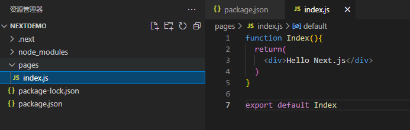
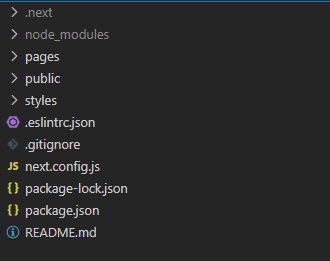

Next.js学习手册

# 什么是Next.js？

[Next.js](https://www.nextjs.cn/docs/getting-started) 是一个开源且易于使用的开发框架。Next.js 是一个 React 开发框架。这意味着 Next.js 基于 React 并提供了部署 React 应用程序所需的所有核心功能。一些常用的功能是服务器端渲染 (SSR)、预渲染、静态站点生成 (SSG)、webpack 支持、页面路由等。


Next.js 是 React 服务端渲染应用框架. 用于构建 SEO 友好的 SPA 应用.

1. 支持两种预渲染方式, 静态生成（SSG）和服务器端渲染（SSR）.
2. 基于页面的路由系统, 路由零配置
3. 自动代码拆分（code splitting）. 优化页面加载速度.
4. 支持静态导出, 可将应用导出为静态网站.
5. 内置 CSS-in-JS 库 styled-jsx
6. 方案成熟, 可用于生产环境, 世界许多公司都在使用
7. 应用部署简单, 拥有专属部署环境 Vercel, 也可以部署在其他环境

# 创建Next.js项目

**🕹系统环境**

- Node.js： v18.0.0
- react：18.0.0
- Next.js：12.1.5（[Node.js 12.22.0](https://nodejs.org/) 或更高版本）

### 手动创建  自己配置

1. 命令行创建文件夹并初始化

```Bash
Mkdir NextDemo

cd NextDemo

npm init
```

1. 安装项目依赖

```Bash
npm install --save react react-dome next
```

 安装完成后`package.json`

```JSON
{
  "name": "nextdemo",
  "version": "1.0.0",
  "description": "",
  "main": "index.js",
  "scripts": {
    "test": "echo \"Error: no test specified\" && exit 1",
  },
  "author": "",
  "license": "ISC",
  "dependencies": {
    "next": "^12.1.5",
    "react": "^18.0.0",
    "react-dom": "^18.0.0"
  }
}
```

1. 增加快捷命令

```JSON
"scripts": {
    "test": "echo \"Error: no test specified\" && exit 1",
    "dev" : "next" ,
    "build" : " next build",
    "start" : "next start"
},
```

1. 创建pages文件夹和文件

-  在 Next.js 中，页面是被放置在 `pages` 文件夹中的 React 组件
- 组件需要被默认导出
- 组件文件中不需要引入 React
- 页面地址与文件地址是对应关系

```jsx
function Index(){
  return(
    <div>Hello Next.js</div>
  )
}
export default Index
```

写好后在终端中使用 `npm run dev`来打开预览，在浏览器中可以看到输出了正确的结果。



### creact-next-app 快速创建Next.js项目

`create-next-app`可以快速的创建Next.js项目，它就是一个脚手架，有了它只要一句命令就可以把项目需要的依赖包和基本目录都生成，日常开发中基本不用手动的形式自己创建，全部使用create-next-app来创建。


安装`create-next-app`，使用脚手架前，需要先进行全局安装。

```Bash
npm install -g create-next-app
```

目前可以支持三种方式的创建，分别是用`npx`,`yarn`和`create-next-app`命令来进行安装，安装的结构都是完全一样的，本次采用的是npx的形式。


npx 是Node自带的npm模块，所以你只要安装了Node都是可以直接使用npx命令的。

但低版本的Node是不带这个命令的，所以你需要手都安装一下。

```Bash
npm install -g npx
```


打开命令提示符工具，然后直接用下面的npx命令创建项目。

```Bash
npx create-next-app react-dome
```

如果希望使用 TypeScript 开发项目，可以通过 `--typescript` 参数创建 TypeScript 项目：

```Bash
npx create-next-app react-dome --typescript
```

安装完成后：

- 运行 `npm run dev` 或 `yarn dev` 来启动开发服务器，访问地址为 `http://localhost:3000`。
- 通过 `http://localhost:3000` 地址访问你的应用程序。
- 编辑 `pages/index.js` 文件并在浏览器中查看更新。


### Next.js项目结构介绍



components文件夹:这里是专门放置自己写的组件的，这里的组件不包括页面，指公用的或者有专门用途的组件。（手动创建）

node_modules文件夹：Next项目的所有依赖包都在这里，一般我们不会修改和编辑这里的内容。

pages文件夹：这里是放置页面的，这里边的内容会自动生成路由，并在服务器端渲染，渲染好后进行数据同步。

public文件夹： 这个是静态文件夹，比如项目需要的图片、图标和静态资源都可以放到这里。

.gitignore文件： 这个主要是控制git提交和上传文件的，简称就是忽略提交。

styles文件夹：存放样式文件

next.config.js：对于 Next.js 的自定义高级配置

package.json文件：定义了项目所需要的文件和项目的配置信息（名称、版本和许可证），最主要的是使用npm install 就可以下载项目所需要的所有包。

# 路由

Next.js 有一个基于文件系统的路由器，它建立在pages 的概念之上。

将文件添加到`pages`目录时，它会自动作为路由使用。

目录中的文件`pages`可用于定义最常见的模式。

### 一、Next.js 中基于文件的路由架构

```Bash
react-dome
└── pages
    └── api // API routes
    ├── _app.js // custom route (will **not** be used as a route)
    ├── index.js // index route (will be rendered at my-site.com)
    ├── about.js // predefined route (will be rendered at my-site.com/about)
    ├── contact.js // predefined route (will be rendered at my-site.com/contact)
    └── blog
        ├── index.js // index route for blog (will be rendered at my-site.com/blog) 
        ├── author.js // predefined route (will be rendered at my-site.com/blog/author)
        ├── [blog-id].js // handles dynamic route (will render dynamcially, based on the url parameter)
        └── [...slug].js // handles catch all route (will be rendered at all routes following my-site.com/blog)
```

#### 保证pages目录的干净

对于现在的组件化开发，我们通常会有两种组件，一种作为某个**独立功能的小组件**，一种是作为页面显示的**页面组件**（通常结合了多个小组件），Nexjs同样适用， 但小组件不能存储在pages目录下，这会导致路由系统混乱。我们可以新建一个components目录（根据自己喜好自定义名字）来存储小组件，在需要时从该目录下import使用即可。

多级路由：

如果路由有多级，直接在pages下创立父级目录，再把最终路由文件放入目录下即可实现多级路由。如在pages目录下创建user目录，user下再创建index.js和home.js，那么路由/user就对应index.js文件，/user/home就对应home.js文件

#### 自定义页面

_app.js页面文件夹中的页面。此页面是自定义页面。Next.js不将自定义页面用作路由，它们的前缀是下划线 ( _)。Next.js 使用_app.js来初始化网页。该组件初始化应用程序并传递pagePropsprop，这是我们网站中所有嵌套组件所需的数据。

作为根组件，可以定义一个我们想要在所有页面中持久化的布局。

```jsx
//pages/_app.js
import Layout from '../components/Layout'
import '../styles/globals.css'

function MyApp({ Component, pageProps }) {
  return (
    <Layout>
      <Component {...pageProps} />
    </Layout>
  ); 
}
export default MyApp
```

#### **索引路线**

路由器将自动将命名的文件路由`index`到目录的根目录。

- `pages/index.js`→`/`
- `pages/blog/index.js`→`/blog`

#### 静态路由

一些路由呈现**静态数据**：它们不使用 URL 中的查询参数来呈现数据。

将创建的两个静态路由是about.js和contact.js。这些文件将分别用于/about和/contact路由。

#### **嵌套路由**

路由器支持嵌套文件。如果创建嵌套文件夹结构，文件将自动以相同的方式路由。

- `pages/blog/author.js`→`/blog/author`

#### **动态路由**

在 Next.js 中，**动态路由**是动态呈现内容的特殊路由，具体取决于id来自 URL 的查询。

[param].js动态路由由使用约定定义的特殊文件处理。param从查询对象中获取。

要匹配动态段，可以使用括号语法。这允许匹配命名参数。

- `pages/blog/[blogId].js`→ `/blog/:blogId`( `/blog/1`)

```jsx
import { useRouter } from 'next/router'

const Blog = () => {
  const router = useRouter()
  const { blogId} = router.query
  return <p>Blog : {blogId}</p>
}
export default Blog
```

路由`/post/abc`将具有以下`query`对象：

```JSON
{ "blogId": "abc" }
```

路由`/post/abc?foo=bar`将具有以下`query`对象：

```JSON
{ "foo": "bar", "blogId": "abc" }
```


- `pages/post/[...slug].js匹配/post/a, 但也/post/a/b,/post/a/b/c等等。`

通过展开运算符，可以将动态路由扩展到捕捉所有路径

```JSON
{ "slug": ["a"] }

{ "slug": ["a", "b"] }
```

### 二、跳转页面

Nextjs官方推荐了两种跳转方式，一种是`Link`组件包裹，一种使用`Router`，我个人是不推荐`Link`的，原理也是用`Router`实现的，使用也简单，但用起来总感觉很冗余。

#### 标签式导航

`<Link>`组件用于在 Next 应用程序中实现页面转换。这个组件最大的特点是它允许你将查询参数传递给useRouter，这是你用来在动态路由上呈现内容的东西。

```jsx
import Link from 'next/link'

function Home() {
  return (
    <ul>
      <li>
        <Link href="/">
          <a>Home</a>
        </Link>
      </li>
      <li>
        <Link href="/about">
          <a>About Us</a>
        </Link>
      </li> 
      <li>
        <Link href="/blog/author">
          <a>Blog Post</a>
        </Link>
      </li> 
      <li>
        <Link href="/blog/1">
          <a>Blog Info</a>
        </Link>
      </li> 
      {posts.map((post) => (
        <li key={post.id}>
          <Link
            href={{
              pathname: '/blog/[slug]',
              query: { slug: post.slug },
            }}
          >
            <a>{post.title}</a>
          </Link>
        </li>
      ))}
    </ul>
  )
}

export default Home
```

#### Router模块进行跳转

Nextjs提供了一个**'next/router'**的包，专门用来处理路由。Router便是其中一个对象，使用前引入`Router`，`Router.push('url')`进行跳转。

```jsx
// pages/index.js
import Router from 'next/router'

const Home = () => {
  function gotoA() {
    // Router.push('/blog/kaiA')
    Router.push({
      pathname: '/blog/kaiA',
      query: {
        name:'kaiA',
        id: '666'
      }
    })
  }
  return (
      <div>
          <button onClick={gotoA}>去kaiA页面</button>
      </div>
  )
}

export default Home
```

### 三、传递和接收参数

项目开发中一般都不是简单的静态跳转，而是需要动态跳转的。动态跳转就是跳转时需要带一个参数或几个参数过去，然后在到达的页面接受这个传递的参数，并根据参数不同显示不同的内容。比如新闻列表，然后点击一个要看的新闻就会跳转到具体内容。这些类似这样的需求都都是通过传递参数实现的。

在Next.js中只能通过通过query（?id=1）来传递参数，而不能通过(path:id)的形式传递参数

```jsx
import { withRouter } from 'next/router';
import Link from 'next/link';

const kaiA = ({ router }) => {
  return (
    <>
      <div>这是{router.query.name}页面 </div>
      <Link href='/'><a>返回首页</a></Link>
    </>
  )
}

export default withRouter(kaiA)
```

Next框架的路由跳转时带参数时，此处使用`withRouter`进行接收，也可以使用`useRouter `进行接受。

### 四、路由钩子

Next 版本11之前支持直接使用`router.events`监听，以下为相应代码：

```jsx
import Link from 'next/link'
import Router  from 'next/router'

function HomePage() {
  function toA() {
    Router.push({
      pathname: '/a',
      query: {
        id: 3
      }
    })
  }
  Router.events.on('routeChangeStart',(...args)=>{
    console.log('1.routeChangeStart->路由开始变化,参数为:',...args)
  })
  Router.events.on('routeChangeComplete',(...args)=>{
    console.log('2.routeChangeComplete->路由结束变化,参数为:',...args)
  })
  Router.events.on('beforeHistoryChange',(...args)=>{
    console.log('3,beforeHistoryChange->在改变浏览器 history之前触发,参数为:',...args)
  })
  Router.events.on('routeChangeError',(...args)=>{
    console.log('4,routeChangeError->跳转发生错误,参数为:',...args)
  })
  Router.events.on('hashChangeStart',(...args)=>{
    console.log('5,hashChangeStart->hash跳转开始时执行,参数为:',...args)
  })
  Router.events.on('hashChangeComplete',(...args)=>{
    console.log('6,hashChangeComplete->hash跳转完成时,参数为:',...args)
  })
  return (
    <>
      <Link href='/a?id=2' title='a'>
        <Button>Welcome to Next.js!</Button>
      </Link>
      <Button onClick={toA}>跳转去a</Button>
    </>
  )
  }
  
  export default HomePage
```

Next 11之后预渲染期间不再支持`router.events`直接监听，需要通过`useEffect`访问

```jsx
import Link from 'next/link'
import Router  from 'next/router'

function HomePage() {
  function toA() {
    Router.push({
      pathname: '/a',
      query: {
        id: 3
      }
    })
  }
  useEffect(() => {
    const handleRouteChange = (url, { shallow }) => {
      console.log(
        `App is changing to ${url} ${shallow ? 'with' : 'without'} shallow routing`
      )
    }
    // 路由开始变化
    router.events.on('routeChangeStart', handleRouteChange)
    // 路由结束变化
    router.events.on('routeChangeComplete', handleRouteChange)
    // >在改变浏览器 history之前触发
    router.events.on('beforeHistoryChange', handleRouteChange)
    // 跳转发生错误
    router.events.on('routeChangeError', handleRouteChange)
    // hash跳转开始时执行
    router.events.on('hashChangeStart', handleRouteChange)
    // hash跳转完成时
    router.events.on('hashChangeComplete', handleRouteChange)
    return () => {
      //如果组件已卸载，取消订阅
      //使用' off '方法处理事件:
      router.events.off('routeChangeStart', handleRouteChange)
      router.events.off('routeChangeComplete', handleRouteChange)
      router.events.off('beforeHistoryChange', handleRouteChange)
      router.events.off('routeChangeError', handleRouteChange)
      router.events.off('hashChangeStart', handleRouteChange)
      router.events.off('hashChangeComplete', handleRouteChange)
    }
  }, [router])

  return (
    <>
      <Link href='/a?id=2' title='a'>
        <Button>Welcome to Next.js!</Button>
      </Link>
      <Button onClick={toA}>跳转去a</Button>
    </>
  )
  }

  export default HomePage

  
```

# API路由

### **什么是 API Routes**

- API Routes 可以理解为接口，客户端向服务器端发送请求获取数据的接口
- Next.js 应用允许 React 开发者编写服务器端代码创建数据接口
- API 路由为使用 Next.js 构建自己的 API 提供了一种简单的解决方案，接触过mock的应该很好理解，就把它当做mock来用就好；

### **如何实现 API Routes**

- 在 pages/api 文件夹中创建 API Routes 文件，比如 user.js
- `pages/api 目录下的任何文件都将作为 API 端点映射到 /api/*`
- 例如请求接口 `/api/user` next就会去pages/api文件夹下找到 `user.js / ts` 文件

```JavaScript
export default (req, res) => {
  res.statusCode = 200
  res.setHeader('Content-Type', 'application/json')
  res.end(JSON.stringify({ name: 'John Doe' })) // 接口会返回这条数据
}
```

要处理 API 路由的不同 HTTP 方法，可以在请求处理器中使用 `req.method`，如下所示：

```JavaScript
export default function handler(req, res) {
  if (req.method === 'POST') {
    // Process a POST request
  } else {
    // Handle any other HTTP method
  }
}
```

### 访问 API Routes：

localhost://3000/api/user

不要在 getStaticPaths 或 getStaticProps 函数中访问 API Routes，因为这两个函数就是在服务器端运行的，可以直接写服务器端代码

# 页面SSR 钩子以及SSG

Next.js 具有两种形式的预渲染： **静态生成（Static Generation）** 和 **服务器端渲染（Server-side Rendering）**。这两种方式的不同之处在于为 page（页面）生成 HTML 页面的 **时机** 。

- **[静态生成 （推荐）](https://www.nextjs.cn/docs/basic-features/pages#static-generation-recommended)**：HTML 在 **构建时** 生成，并在每次页面请求（request）时重用。
- **[服务器端渲染](https://www.nextjs.cn/docs/basic-features/pages#server-side-rendering)**：在 **每次页面请求（request）时** 重新生成 HTML。

### 获取数据的方式

getInitialProps在最新版本建议不使用

| 获取数据方法       | 静态化 | 异步 | 只能在pages文件夹下 | 作用         | 服务端请求                 |
| ------------------ | ------ | ---- | ------------------- | ------------ | -------------------------- |
| getStaticProps     | 是     | 是   | 是                  | 请求数据     | 是http（非XMLHttpRequest） |
| getStaticPaths     | 是     | 是   | 是                  | 生成动态路由 | 是                         |
| getServerSideProps | 否     | 是   | 是                  | 请求数据     | 是                         |

#### getServerSideProps（SSR）每次访问时请求数据

页面中`export`一个`async`的`getServerSideProps`方法，next就会在每次请求时候在服务端调用这个方法。

- 方法只会在服务端运行，每次请求都运行一边`getServerSideProps`方法
- 如果页面通过浏览器端`Link`组件导航而来，Next会向服务端发一个请求，然后在服务端运
- `getServerSideProps`方法，然后返回JSON到浏览器。


getServerSideProps**方法主要是升级了9.3之前的**`getInitialProps`**方法**


9.3之前的`getInitialProps`方法有一个很大的缺陷是在浏览器中`req`和`res`对象会是`undefined`。也就是使用它的页面，如果是浏览器渲染你需要在组件内再显示地请求一次。开发体验不太好。 如果没有特殊问题，建议使用`getServerSideProps`替代`getInitialProps`方法。

```tsx
import { GetServerSideProps, NextPage } from 'next'

interface PostProps {
  list: Post[]
}

const App: NextPage<PostProps> = props => {
  return <div></div>
}

export const getServerSideProps: GetServerSideProps<PostProps> = async context => {
  const list = await context.req.service.post.getPost(context.params.postID)
  return {
    props: {
      list
    }
  }
}

export default App
```

#### getStaticProps和getStaticPaths（SSG）构建时请求数据

所谓的SSG也就是静态站点生成，是在build阶段将页面构建成静态的html文件，这样线上直接访问HTML文件，性能极高。

Next.js 在9.0的时候引入了自动静态优化的功能，也就是如果页面没有使用`getServerSideProps`和`getInitialProps`方法，Next在build阶段会生成html，以此来提升性能。

但是正如上文说的，一般应用页面都会需要动态的内容，因此自动静态优化局限性很大。

Next 在9.3中更近了一步，引入了`getStaticProps`和`getStaticPaths`方法来让开发者指定哪些页面可以做SSG优化。

- 使用`getStaticProps`方法在build阶段返回页面所需的数据。
- 如果是动态路由的页面，使用`getStaticPaths`方法来返回所有的路由参数，以及是否需要回落机制。

```tsx
export async function getStaticPaths() {
  // Call an external API endpoint to get posts
  const res = await fetch('https://.../posts')
  const posts = await res.json()
  // Get the paths we want to pre-render based on posts
  const paths = posts.map(post => ({
    params: { id: post.id },
  }))
  // We'll pre-render only these paths at build time.
  // { fallback: false } means other routes should 404.
  return { paths, fallback: true };
}
export const getStaticProps: GetStaticProps<InitProps> = async ({ params }) => {
  const data = await fetch(
    `http://.../api/p/${params.bookUUID }/${params.postUUID }`
  );

  return {
    props: {
      post: data,
    },
  };
};
```

使用非常的简单，需要注意的是：

1. `getStaticPaths`方法返回的`fallback`很有用：如果`fallback`是`false`，访问该方法没有返回的路由会404
2. 但是如果不想活着不方便在build阶段拿到路由参数，可以设置`fallback`为`true`，Next在访问build中没有的动态路由时候，先浏览器loading，然后服务端开始build该页面的信息，然后再返回浏览器渲染，再次访问该路由该缓存就会生效，很强大！！
3. **静态缓存目前没办法很灵活的更新！！**，例如博客内容在build或者fallback生效之后发生更改，目前没办法很方便的替换缓存。

### 如何选择SSR还是SSG？

1. 如果页面内容真动态(例如，来源数据库，且经常变化)， 使用`getServerSideProps`方法的SSR。
2. 如果是静态页面或者伪动态(例如，来源数据库，但是不变化)，可以酌情使用SSG。

# NextJs 请求数据（fetch axios）

### 一、fetch 

官方推荐的是fetch 注意 fetch中的路径应是完整的路径

```JavaScript
function About({ data }) {
    console.log(data) //在这里打印的可在控制台输出
    return (
        <div>
            {
                data.map( item => (
                    <li key={item.id}>{item.title}</li>
                ))
            }
        </div>
    )
}

export const getStaticProps = async () => {
    let result = await fetch('http://apitest.dianzhijia.com/api/open/article?page=1',{
        headers: {
            Accept: 'application/vnd.dpexpo.v1+json' //设置请求头
        },
        method: 'get',
    })

    let res = await result.json() //必须通过此方法才可返回数据
    const {data: {data}} = res
    return {
        props: {
            data //props值传导render函数中
        }
    }
}

export default About
```

### 二、Axios

安装和引入`Axios`插件

打开终端，直接使用npm令进行安装。

```CoffeeScript
npm  install axios -S
```

#### 封装axios

1. 在utils下新建request.js

```JavaScript
import axios from 'axios'

const instance = axios.create({
  // baseURL: process.env. APP_BASE_API  // 配置环境变量取baseURL
  baseURL: 'http://localhost:3000/',
  timeout: 10000,
})

instance.interceptors.request.use(
  config => config,
  error => Promise.reject(error),
)

instance.interceptors.response.use(
  response => response,
  error => Promise.reject(error),
)

export default instance
```

1. 书写api方法

```JavaScript
import request from '../utils/request'

export const getUserList = () => {
  return request.get(`/api/user`)
}

export const getUserInfo = (params) => {
  return request.get(`/api/user/${params.userId}`)
}
```

1. 组件使用，在pages下新建js文件

```jsx
import { getArticle } from './api/article'

function About({ data }) {
    console.log(data)
    return (
        <div>
            {
                data.map( item => (
                <li key={item.id}>{item.title}</li>
                ))
            }
        </div>
    )
}

export const getStaticProps = async () => {
    let result = await getArticle({per_page: 1})
    let { data: { data } } = result
    return {
        props: {
            data
        }
    }
}

export default About
```


#### 配置环境变量

`Next.js`是一个轻量级的react服务端渲染应用框架，所以他不用考虑前端经常要涉及到的跨域。可以通过配置环境变量获取各个环境下的请求域名，需要对`Next.js`中环境变量进行一下处理：

1. 创建`.env`文件，在根目录下创建3个`.env`文件

```Rust
// .env.development
APP_ENV=development
APP_BASE_API = 'http://localhost:9001'

// .env.test
APP_ENV=test
APP_BASE_API = 'https://api.test.com'

// .env.production
APP_ENV=production
APP_BASE_API = 'https://api.prod.com'
```

1. 配置`next.config.js`

```JavaScript
module.exports = {
  reactStrictMode: true,
  // 环境变量
  env: {
    APP_ENV: process.env.APP_ENV
  }
}
```

1. 配置`package.json`

```Groovy
"scripts": {
    "dev": "APP_ENV=development next dev",
    // 开发环境中调用线上接口
    "dev:prod": "APP_ENV=production next dev",
    // 打测试包
    "build:test": "APP_ENV=test next build",
    "build:prod": "APP_ENV=production next build",
    "start": "next start",
    "lint": "next lint"
  },
```

1. 使用

```JavaScript
// utils/request.js

let baseURL = process.env.APP_BASE_API

...
```

#### **rewrites**

虽然Next.js有对动态路由api的开发，但大多前端使用`webpack`较多，`proxy`大多习惯配置在`webpack-dev-server`的`proxy-table`中，但nextjs并未使用到`webpack-dev-server`，大多前端常用到的`proxy-table`无法在`Next.js`中配置。所以我们需要使用到官方提供的`rewrites`。

**成本低，入侵小，支持版本v10.1+**

Rewrites allow you to map an incoming request path to a different destination path.

官方解释：重写允许您将传入请求路径映射到不同的目标路径(机翻)[文档地址](https://link.zhihu.com/?target=https://www.nextjs.cn/docs/api-reference/next.config.js/rewrites)

```JavaScript
//next.config.js
module.exports = {
  async rewrites() {
    return {
      fallback: [
        {
          source: '/:path*',
          destination: `http://localhost:9001/:path*`,
        },
      ],
    }
  },
}
```

# Next.js框架下使用Ant Design UI

1. 加载antd

```Dockerfile
npm install antd 
```

1. 在pages目录下_app.js文件，写入下列内容

```JavaScript
import '../styles/globals.css' 
import 'antd/dist/antd.css' 

function MyApp({ Component, pageProps }) { 
    return <Component {...pageProps} /> 
} 

export default MyApp
```

1. 在index.js中引入Button组件

```jsx
import Head from 'next/head' 
import {Button} from 'antd' 

export default function Home() { 
    return ( 
        <> 
            <Head> 
                <title>Home</title> 
            </Head> 
            <div> <Button type="primary">Primary Button</Button></div> 
        </> 
    ) 
}
```

# Next.js生产环境打包


```bash
npm run build
```

