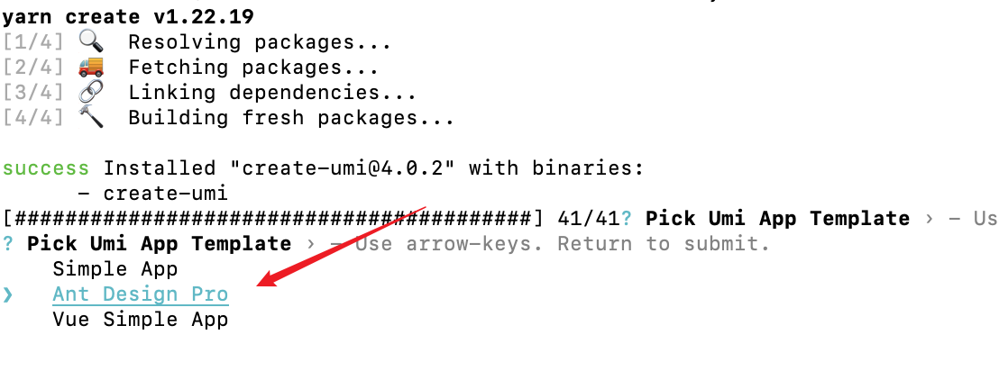
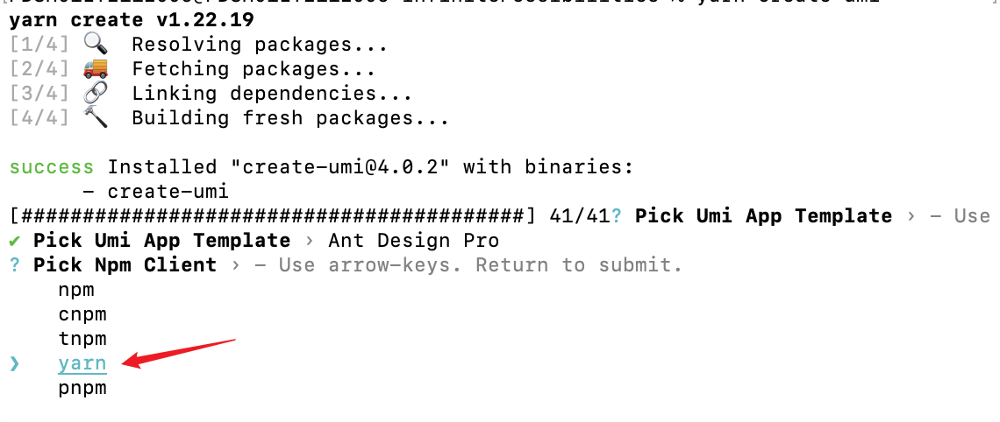
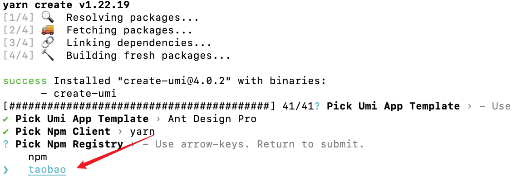
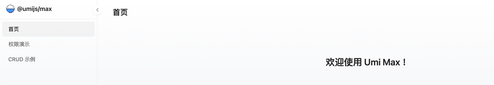

## 运行环境
首先得有 node，并确保 node 版本是 14 或以上。

查看`node`版本

```bash
node -v
```

安装`yarn`

```bash
npm install -g yarn
```

- node.js ：16.15.1
- Umi.js：4.0.2
- React：18.0.0
- Antd：4.21.4
- yarn：1.22.19

## 创建umi项目

1. 创建项目目录

```bash
mkdir myUmi && cd myUmi
```

2. 创建项目

你可以通过  `yarn create umi` 或 `npm create umi` 使用 create-umi。推荐使用` yarn create` 命令，能确保每次使用最新的脚手架。

2.1  执行脚手架命令
```bash
yarn create umi
```

2.2 选择antd



2.3 选择下载依赖工具 `yarn`



2.4 选择安装源

国内建议选 **taobao 源**，速度提升明显



2.5 运行项目

```bash
yarn dev
```




