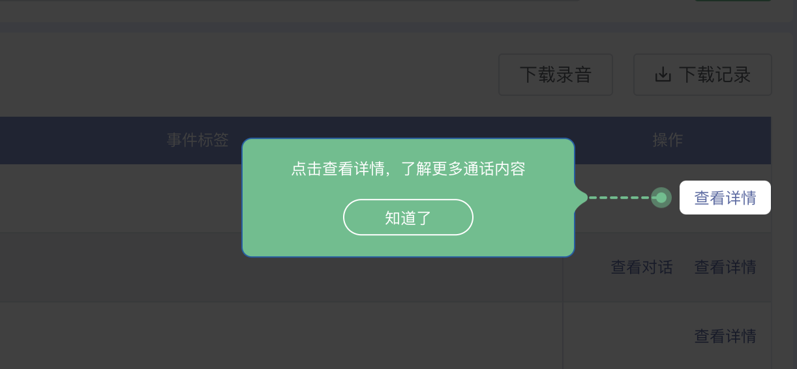

## 通过css实现简单的新手指引组件border/

在项目中对于UI样式要求比较多的一些引导效果，可以自己动手写一个组件，相对来说也是比较简单的，比起插件更方便一点。

本文主要是在Vue2项目中的实践代码，需要用在其他框架里面的话，简单转换一下就行了，思路都是一致的。

新手指引样式的实现主要在于，遮罩层和留白样式的处理，可以通`border`或者`box-shadow`两种方案实现，效果图如下：



### 1. `box-shadow`创建一个大的投影

因为`box-shadow`本身就不占据空间，鼠标事件对它们是没有效果的，自带“穿透”效果，所以除了要对镂空遮罩层设置`pointer-events:none`，还需要再覆盖一层透明的遮盖层，同样监听父级容器的`mousemove`事件，比较麻烦。

```html
<div class="guide_wrap" style="top: 108px;left: 207px;width: 197px;height: 281px;border-radius: 4px;background-color: transparent;">
</div>


<style>
  .guide_wrap{
    pointer-events: none;
    position: fixed;
    box-shadow: 1px 1px 1px 2000px rgba(0,0,0,.8);
    -webkit-appearance: none;
    z-index: 999;
    margin: 0;
    padding: 0;
    border-radius: 50%;
    height: 30px;
    width: 30px;
    top: 72px;
    left: 15px;
  }
</style>
```

### 2. 利用 css 的 `border` 属性，创建一个无限大的 `border`（示例图采用方案）

占据空间，无事件穿透影响，但是镂空内容无法设置圆角，需要要额外处理一下，直接贴全部代码

组件`GuideWrap.vue`

```vue
<template>
  <div class="guide_wrap" :style="guideStyle" v-if="showGuide">
    <!-- 遮罩层Tip -->
    <div class="mask-tip">
      <span id="mask-desc" class="mask-tip-desc">{{ desc }}</span>
      <span id="mask-next" class="mask-tip-btn" @click="showGuide = false">知道了</span>
    </div>

    <!-- 解决留白内容方形的问题，设置四个圆角-----若无样式要求可省略  -->
    <div class="concave—round-1 concave—round"><div class="concave—content concave—content-1"></div></div>
    <div class="concave—round-2 concave—round"><div class="concave—content concave—content-2"></div></div>
    <div class="concave—round-3 concave—round"><div class="concave—content concave—content-3"></div></div>
    <div class="concave—round-4 concave—round"><div class="concave—content concave—content-4"></div></div>
  </div>
</template>

<script>
export default {
  name: 'GuideWrap',
  data() {
    return {
      guideStyle: {},
      showGuide: false
    }
  },
  props: ['desc'],
  components: {},
  mounted() {},
  methods: {
    fetchGuid(value) {
      /** **************   要cover的元素基本信息   ****************/
      const { width, height, top, left } = value
      /** **************   获取屏幕大小，包含滚动区域   ****************/
      var scrollWidth = document.body.scrollWidth
      var scrollHeight = document.body.scrollHeight
      /** **************   设置样式   ****************/
      this.guideStyle = {
        width: scrollWidth + 'px',
        height: scrollHeight + 'px',
        borderColor: 'rgba(0, 0, 0, 0.75)',
        borderStyle: 'solid',
        borderLeftWidth: left - 10 + 'px',
        borderRightWidth: scrollWidth - width - left - 10 + 'px',
        borderTopWidth: top - 10 + 'px',
        borderBottomWidth: scrollHeight - height - top - 10 + 'px'
      }
      this.showGuide = true
    }
  }
}
</script>

<style lang='scss' scoped>
.guide_wrap {
  position: fixed;
  left: 0;
  top: 0;
  border-color: rgba(0, 0, 0, 0.75);
  border-style: solid;
  z-index: 999999;
}
.mask-tip {
  width: 256px;
  text-align: center;
  border: 1px solid rgb(0, 94, 166);
  border-radius: 8px;
  padding: 16px;
  position: absolute;
  right: 200px;
  top: 50%;
  transform: translateY(-50%);
  background: #56bf8b;
}
.mask-tip:before {
  content: '';
  width: 75px;
  height: 24px;
  position: absolute;
  transform: translateY(-50%);
  top: 50%;
  right: -75px;
  background-image: url('../../images/guide.png');
  background-size: 100%;
}
.mask-tip-desc {
  display: block;
  color: white;
  font-size: 12px;
  margin-bottom: 16px;
}

.mask-tip-btn {
  border-radius: 4px;
  font-size: 12px;
  cursor: pointer;
  color: white;
  display: inline-block;
  min-width: 100px;
  height: 28px;
  line-height: 28px;
  border-radius: 16px;
  border: 1px solid #ffffff;
}
// 留白内容内圆角样式，如不需要，可省略
.concave—round {
  width: 10px;
  height: 10px;
  background-color: rgba(0, 0, 0, 0.75);
  position: absolute;
}
.concave—round-1 {
  top: 0;
  left: 0;
}
.concave—round-2 {
  top: 0;
  right: 0;
}
.concave—round-3 {
  bottom: 0;
  right: 0;
}
.concave—round-4 {
  bottom: 0;
  left: 0;
}
.concave—content {
  width: 10px;
  height: 10px;
  background-color: white;
}
.concave—content-1 {
  border-radius: 50% 0 0 0;
}
.concave—content-2 {
  border-radius: 0 50% 0 0;
}
.concave—content-3 {
  border-radius: 0 0 50% 0;
}
.concave—content-4 {
  border-radius: 0 0 0 50%;
}
</style>

```

页面中使用组件`GuideWrap`

```vue
<template>
  <div style="background-color: #fff; height: 100vh">
    <div class="box">
      <button ref="viewDetial" class="">查看详情</button>
    </div>
    <GuideWrap ref="guide" desc="点击查看详情，了解更多通话内容"></GuideWrap>
  </div>
</template>

<script>
import GuideWrap from '../components/Guide'
export default {
  data() {
    return {}
  },
  components: { GuideWrap },
  mounted() {
    this.$nextTick(() => {
      const value = this.$refs['viewDetial'].getBoundingClientRect()
      this.$refs['guide'].fetchGuid(value)
    })
  },
  methods: {}
}
</script>

<style lang='scss' scoped>
.box {
  text-align: right;
  padding-top: 200px;
  padding-right: 200px;
}
</style>

```

