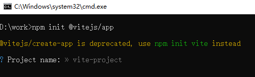
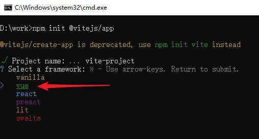
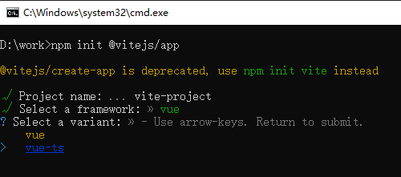
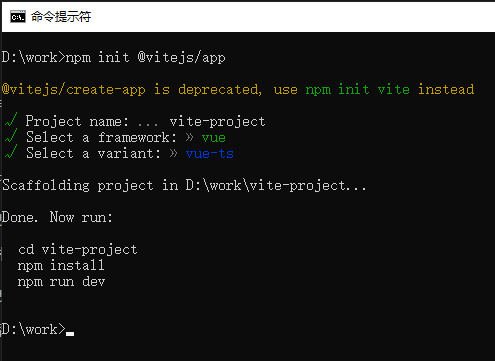
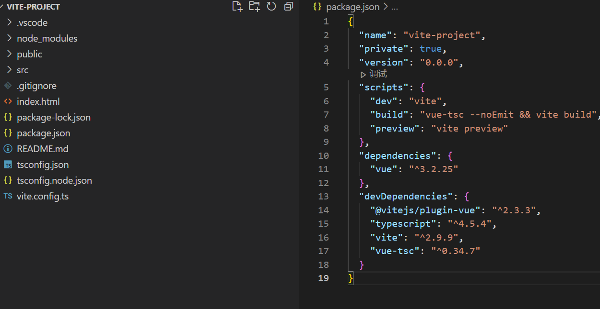
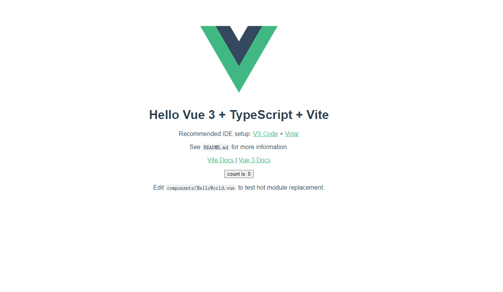

## 环境

> node.js 18.0.0
> npm 8.6.0 


## 涉及依赖

- vue@^3.2.25
- vite@^2.9.9
- vue-router@4.0.13
- vuex@4.0.2
- typescript@^4.5.4
- less@^4.1.1
- @vitejs/plugin-vue-jsx@^1.1.5
- element-plus@^1.0.2-beta.46

## 安装vite脚手架

``` bash

npm install -g create-vite-app
# or
yarn add -g create-vite-app

```

## 创建项目

``` bash

npm init @vitejs/app
# or
yarn create @vitejs/app

```

1. 设置项目名字
  
  

2. 选择预设模版，选择vue

  

  回车后选择项目语言，这里我们选择vue - ts

  

3. 安装完成，进入项目，安装依赖，运行项目
  
``` bash
  // 进入项目
  cd vite-project

  // 安装依赖
  npm install

  // 运行项目
  npm run dev

```

   

4. Vite + Vue3 + TypeScript 简单的项目骨架搭建完毕，打开后样式如下：

  
  

## 规范目录结构

对vite脚手架构建项目的目录结构进行补充，根据日常开发习惯，创建对应的文件夹。

```

├── dist/
└── src/
    ├── api
    │   └── ... // 抽取出API请求
    ├── assets/                    // 静态资源目录
    ├── common/                    // 通用类库目录
    ├── components/                // 公共组件目录
    ├── router/                    // 路由配置目录
    ├── store/                     // 状态管理目录
        ├── index.ts          // 我们组装模块并导出 store 的地方
        ├── getters.ts        // 根级别的 getters
        ├── actions.ts        // 根级别的 action
        ├── mutations.ts      // 根级别的 mutation
        └── modules
            ├── home.ts       // 模块
            └── login.ts       // 模块
    ├── style/                     // 通用 CSS 目录
    ├── utils/                     // 工具函数目录
    ├── views/                     // 页面组件目录
    ├── App.vue
    ├── main.ts
    ├── shims-vue.d.ts
├── tests/                         // 单元测试目录
├── index.html
├── tsconfig.json                  // TypeScript 配置文件
├── vite.config.ts                 // Vite 配置文件
└── package.json

```

## 配置路径别名

Vite 配置文件 vite.config.ts 位于根目录下，项目启动时会自动读取。

简单配置如：设置 @ 指向 src 目录、 服务启动端口、打包路径、代理等。

此时具体配置如下：

``` typescript

import { resolve } from "path"; // 此处如果报错则安装 node/path依赖
import { defineConfig } from "vite";
import vue from "@vitejs/plugin-vue";

export default defineConfig({
  plugins: [vue()],
  server: {
    port: 8082, // 设置服务启动端口号
    open: true, // 设置服务启动时是否自动打开浏览器
    cors: true // 允许跨域
    // 设置代理，根据我们项目实际情况配置
    // proxy: {
    //   '/api': {
    //     target: 'http://xxx.xxx.xxx.xxx:8000',
    //     changeOrigin: true,
    //     secure: false,
    //     rewrite: (path) => path.replace('/api/', '/')
    //   }
    // }
  },
  resolve: {
    alias: {
      "@": resolve(__dirname, "/src"), // 设置 `@` 指向 `src` 目录
    },
  },
});


```

## 配置路由 Router

**安装vue-router**

``` bash 

npm i vue-router@next

```

1. 在 src 目录下新建 views/home.vue 、 views/login.vue 、views/404.vue

  例如：

  home.vue

``` javascript

<template> 这是home.vue </template>

```

2. 在 src 目录下新建 router/index.ts


``` typescript

import { createRouter, createWebHashHistory, RouteRecordRaw } from "vue-router";

// 路由配置 和以前一样
const routes: RouteRecordRaw[] = [
  {
    path: "/",
    redirect: "/login",
  },
  {
    path: "/home",
    name: "home",
    meta: {
      type: "home",
    },
    component: () => import("@/views/home.vue"),
  },
  {
    path: "/login",
    name: "login",
    meta: {
      type: "login",
    },
    component: () => import("@/views/login.vue"),
  },
  {
    path: "/:pathMatch(.*)*", // 注意此处 404页面匹配规则和以前不相同，得采用这种配置方式才行
    name: "404",
    component: () => import("@/views/404.vue"),
  },
];

// 此处由【new VueRouter】的方式修改为【createRouter】的方式 其余无变化
const router = createRouter({
  history: createWebHashHistory(), //路由模式的配置采用API调用的方式 不再是之前的字符串 此处采用的hash路由
  routes,
});

export default router;

```

3. 在main.ts这个入口文件中插件的方式通过vue引入就可以了

``` javascript
import App from './App'
import router from "@/router"
import { createApp } from 'vue'

createApp(App).use(router).mount("#app");

```

## 状态管理工具 Vuex

**安装 vuex**


``` bash 

npm i vuex@next

```

vue3中的vuex配置和vue2基本上相同，这里就直接采用模块化的方式创建作为演示了。

1. 首先配置主入口，src目录下创建 store/index.ts 文件

Vite 批量引入文件，[Vite Glob](https://vitejs.cn/guide/features.html#glob-import) 导入，import.meta.glob、import.meta.globEager，可以避免每新增模块的时候我们都要去配置文件里面做一次重复操作。


``` javascript

import { createStore } from 'vuex'

import getters from './getters'
import mutations from './mutations'
import actions from './actions'

const state={}

let modules = {}
// Vite 支持 Glob 导入 https://vitejs.cn/guide/features.html#glob-%E5%AF%BC%E5%85%A5
// 导入 modules 下面的 所有 .ts文件
const modulesFiles = import.meta.globEager("./modules/*.ts")
for (const path in modulesFiles) {
        const moduleName = path.replace(/(.*\/)*([^.]+).*/gi, '$2')
        modules = { ...modules, [moduleName]: modulesFiles[path].default }
}

export default createStore({
        state,
        getters,
        mutations,
        actions,
        modules
})

```

2. 此处仅做 login 这个模块仓库做相关代码的演示,src目录下创建 store/modules/login.ts 文件

``` javascript

import { Module } from "vuex";

export type IUser = Record<"name" | "password", string>;

export interface ILoginState {
  user: IUser;
}

// Module这个类型可以传两个范型变量 第一个是当前模块state的对象接口类型 第二个是主仓库state的对象接口类型 
const LoginStore: Module<ILoginState, {}> = {
  namespaced: true,
  state: {
    user: {
      name: "",
      password: "",
    },
  },
  getters: {},
  mutations: {
    SET_USER(state, payload: IUser) {
      state.user = payload;
    },
  },
  actions: {
    setUser({ commit }, payload: IUser) {
      commit(SET_USER, payload);
    },
  },
};

export default LoginStore;

```

3. 在main.ts文件中挂载 Vuex 配置

``` javascript

import App from './App'
import store from "@/store"
import router from "@/router"
import { createApp } from 'vue'

createApp(App).use(router).use(store).mount("#app");

```